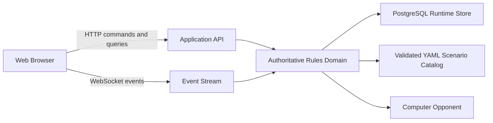

# 1942 Flat Top Web Application Architecture

## 1. Purpose

This document defines the proposed architecture for the web version of 1942 Flat Top. It is a design proposal for review. It does not implement the web application or change the existing Python prototype.

The architecture preserves the existing repository as a monorepo containing:

- the current Python desktop prototype
- the platform-neutral game rules and data design
- the future web client and server
- shared tests and scenario documentation

The web application is a server-authoritative, modular monolith for the first production implementation. It is intentionally not split into microservices while the rules and scenarios are still being stabilized.

## 2. Confirmed Product Decisions

- PostgreSQL is the development and runtime database.
- Developers provide PostgreSQL externally through a configured connection string.
- A new game selects exactly one scenario/map.
- Scenarios are versioned YAML files in the repository.
- Developers review and deploy scenarios.
- YAML scenario files are the source of truth for scenario definitions.
- PostgreSQL stores runtime games, commands, events, saves, and player/session data.
- Future scenarios may require new special rules implemented in code.
- The existing static mockup remains a visual reference, not an authoritative game engine.

## 3. Repository Shape

The web implementation should be added to this repository with clear boundaries:

```text
1942_flattop/
  flattop/
    domain/                 # Authoritative rules, state, commands, events
    scenarios/              # YAML loading, validation, scenario registry
    ai/                     # Computer-player decision making
    api/                    # HTTP and WebSocket adapters
    persistence/            # PostgreSQL repositories and migrations
  web/
    src/
      app/                  # Routing, session shell, new-game flow
      map/                  # Map and hex-board presentation
      air-operations/       # Operations tracker and formation workflow
      task-forces/          # Fleet and ship details
      combat/               # Combat declaration and result review
      state/                # Server projection and command state
      api/                  # Typed HTTP/WebSocket client
  migrations/               # PostgreSQL schema migrations
  scenarios/
    scenario_one.yaml
    scenario_two.yaml
    schema.yaml
  docs/
  tests/
    domain/
    scenarios/
    api/
    persistence/
    web/
```

The exact framework names may change during implementation, but the ownership boundaries should remain.

## 4. Runtime Architecture



### 4.1 Browser client

The browser owns presentation and interaction state only:

- map viewport, zoom, and pan
- selected unit and open panels
- form input and pending visual edits
- display of legal commands returned by the server
- rendering of side-filtered projections
- rendering of event and combat explanations

The browser must not calculate:

- combat hits
- damage
- BHT results
- movement legality
- Launch Factor or Readying Factor legality
- hidden-information disclosures
- Victory Points

### 4.2 Application API

The API adapts transport requests into domain commands and read models. It must not contain game rules that are absent from the domain layer.

Recommended initial transports:

- HTTP for queries, commands, saves, and scenario catalog requests
- WebSocket for committed events, turn updates, AI progress, and multiplayer synchronization

### 4.3 Authoritative domain

The domain owns:

- complete game state
- phase and turn transitions
- command validation
- command execution
- hidden information
- combat resolution
- score events
- deterministic random state
- event emission

Every human and AI action uses the same command boundary.

### 4.4 PostgreSQL runtime store

PostgreSQL stores:

- game metadata
- authoritative snapshots
- committed commands
- event history
- player membership
- scenario/version references
- save points and replay data

The YAML files remain the source of scenario definitions. Database rows reference the exact scenario identifier and version used to create a game.

## 5. Command and Projection Boundary

### 5.1 Command request

Commands represent intent rather than UI objects:

```json
{
  "game_id": "game-123",
  "expected_version": 42,
  "type": "MoveAircraft",
  "payload": {
    "aircraft_type": "SBD",
    "from_state": "READYING",
    "to_state": "READY",
    "count": 2
  }
}
```

The server must reject stale `expected_version` values to prevent conflicting updates.

### 5.2 Validation response

Invalid commands return stable machine-readable codes and a player-facing explanation:

```json
{
  "accepted": false,
  "error": {
    "code": "INSUFFICIENT_RF",
    "message": "Only 1 Readying Factor remains.",
    "details": {
      "requested": 2,
      "available": 1
    }
  }
}
```

### 5.3 Committed command response

Accepted commands return:

- new game version
- changed projection
- emitted event identifiers
- legal next commands
- warnings requiring confirmation, if applicable

### 5.4 Side-filtered projections

A projection is built for a specific player and must include only information that player is allowed to know. Enemy units may be represented as contacts, estimates, or unknowns according to observation state.

## 6. New Game Flow

The first screen must provide a usable new-game workflow:

1. Select `Start New Game`.
2. Request the published scenario catalog from the server.
3. Display scenario name, description, map dimensions, sides, setup summary, and scenario version.
4. Select exactly one scenario.
5. Select player side and opponent type where supported.
6. Confirm the setup summary.
7. The server creates a game referencing the scenario identifier and immutable version.
8. The server returns the initial side-filtered projection.
9. The browser opens the main game screen.

The browser must not load arbitrary YAML directly. The server validates the catalog and exposes only published scenarios.

## 7. AI Integration

The computer opponent initially runs inside the server process as a domain consumer:

- receives a side-filtered knowledge projection
- generates candidate commands
- submits commands through the same validator as human players
- emits explanation events for important decisions

If AI calculations later become slow, the AI can move to a worker process without changing the command contract.

## 8. Deployment Environments

### Development

- externally managed PostgreSQL
- environment variable for the database URL
- migration command run before server startup
- YAML scenarios loaded from the repository checkout
- browser client served by the frontend development server

### Test

- isolated PostgreSQL database or schema per test run
- deterministic random seed
- fixed scenario version
- API and domain tests independent of browser rendering

### Production

- managed PostgreSQL
- immutable application release
- scenario catalog bundled with the release
- explicit scenario publication/versioning check during startup
- separate secrets and database credentials

## 9. Testing Strategy

The build must add tests in layers:

1. Domain tests for state transitions and rules.
2. YAML schema and scenario validation tests.
3. PostgreSQL repository and migration tests.
4. API command and projection tests.
5. Web component and interaction tests.
6. Browser workflow tests for new-game setup, air operations, combat review, and save/load.

A browser test must never be the only test for a rule. Rules must be proven in the domain layer first.

## 10. Architectural Risks

- Keeping the prototype and production domain models synchronized can create accidental duplication.
- YAML can describe data but cannot safely express arbitrary executable rules.
- WebSocket reconnect behavior must not duplicate or lose committed events.
- Scenario versions must be immutable after games reference them.
- PostgreSQL transaction boundaries must guarantee that a command, state update, and event sequence commit atomically.

## 11. Proposed Decision

Proceed with a Python server-authoritative modular monolith and a TypeScript browser client in this repository. Keep the current desktop prototype operational while the web domain is extracted behind explicit commands, projections, YAML scenario loading, and PostgreSQL persistence.
